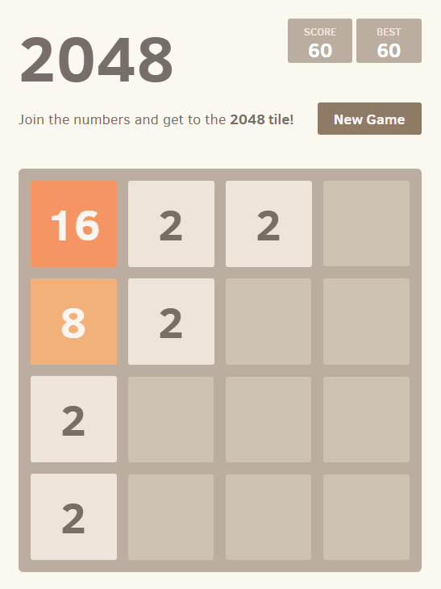
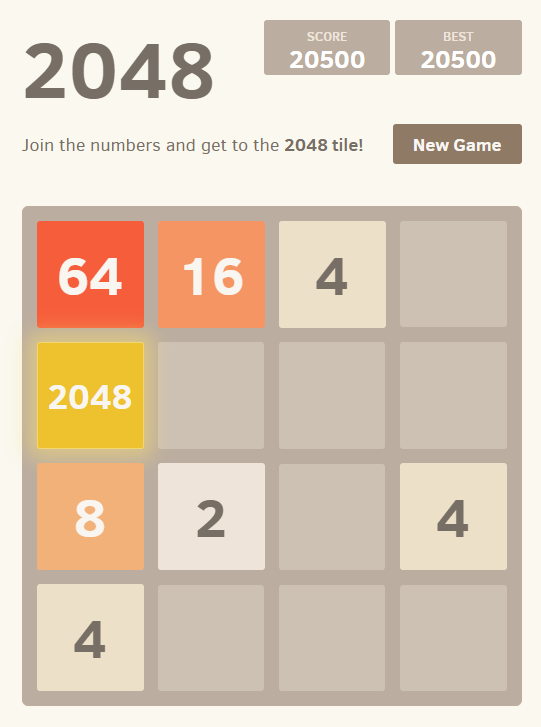
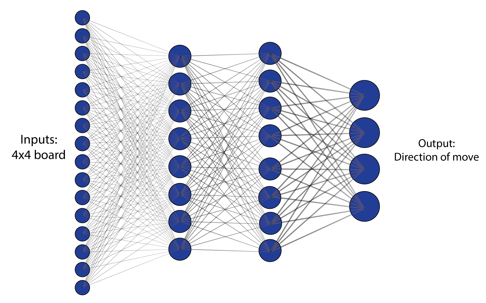

# NN_2048

Learning to play 2048 with artificial neural networks using simple genetic algorithms.

The original game can be played here: https://gabrielecirulli.github.io/2048/

Instructions can be found here: https://en.wikipedia.org/wiki/2048_(video_game)

 

While the goal of this game is quite straight forward, which is to reach 2048 (or beyond), it had challenged the patience of many people when it first came out in 2014 (including me). The idea of this project is to train an (deep) artificial neural network to play this game, without teaching it manually at all.

For the purpose of simplicity, it is assumed that the game ends when no block is moved after a move is applied, a.k.a. STUCK.

- If played randomly, the average number of moves and scores are around 3.63 and 9.38 respectively. 
- The first goal is to train a network that can consistently acheive scores considerably higher than 9.38. 
- The ultimate goal is of course reaching 2048 (lower bound of the score = 20480).

Neural Network Design: [16, 8, 8, 4]

## Current best results ([# of moves, score]):

Average of 1000+ games: [9.76, 43.9]
